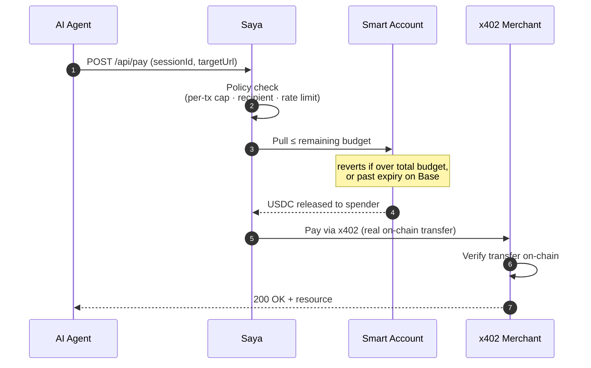

# Saya — AI Agent Payment Safety Layer

**Give an AI agent a wallet without giving it your bank account.**

Saya issues each autonomous agent a *scoped session key* whose **total budget the blockchain itself enforces**. Your agent can pay for what it needs over [x402](https://x402.org) — APIs, compute, data, other agents — but a bug, a jailbreak, or a runaway loop can **never** spend more than the on-chain budget you set.


Runs on **Base** (EVM) and **Solana**, testnet or mainnet, settling in **USDC**.

---

## Why it exists

Autonomous agents increasingly need to *pay* for things. The naive way — hand the agent a funded wallet or an API key with a card behind it — puts you one prompt injection or one infinite loop away from an unbounded bill.

Saya puts a **hard ceiling between the agent and the money**:

- The agent holds a **session key**, never the treasury.
- The **total budget** is enforced by the **smart-contract account itself** on both chains — and on Base, so is expiry — not by a server that could be bypassed or a config that could be edited.
- Every payment is policy-checked, settled on-chain, and written to an audit log.

The result: agents that transact freely *inside* a sandbox you define, and cannot step outside it.

---

## Features

- **On-chain hard limits** — the total budget is enforced by the chain on both networks (CDP Spend Permissions on Base, SPL token delegation on Solana), and expiry too on Base. Neither the backend nor the agent can override the on-chain limits.
- **Multi-chain** — Base (EVM) and Solana run side by side; choose per session. USDC-native with 6-decimal integer math (no floating-point money bugs).
- **x402-native** — agents pay for HTTP resources through the x402 challenge/response flow, settled with a **real on-chain USDC transfer** that the seller verifies before releasing the resource.
- **Policy engine** — per-transaction caps, recipient allowlists, and a rate-limiting **circuit breaker** that auto-suspends *and revokes the key on-chain* the moment it trips.
- **Full audit trail** — every decision, approved or rejected, is persisted with a reason code and queryable by agent, session, decision, or time.
- **Built-in auth** — all API routes are protected by a bearer token, and the server **refuses to start on mainnet without one**.
- **Ops dashboard** — create sessions, watch remaining budget and risk flags, revoke keys, and filter the audit log from a clean web UI.
- **One-command setup** — `docker compose up`, or a guided `npm run setup` that validates your credentials and funds a test wallet automatically.

---

## How it works

A payment is deliberately **two hops**. The on-chain permission delivers funds to *your* spender rather than straight to a merchant — and that indirection is exactly what lets the chain cap the spend:



1. **Pull (on-chain, capped).** The spender pulls up to the *remaining* budget from the agent's treasury smart account via the Spend Permission. The chain **reverts** if the pull would exceed the total budget (both chains) — or, on Base, occur after expiry. The per-transaction cap and recipient allowlist are checked a step earlier, by the policy engine.
2. **Pay (merchant leg).** The spender pays the x402 merchant with a real on-chain USDC transfer — gasless via the CDP paymaster on Base — and the seller verifies that transfer on-chain before serving the resource.

---

## Verifiable enforcement

Saya's guiding principle: **enforce every limit at the strongest layer the chain allows, and tell you exactly which layer that is.** No limit is ever silently downgraded to something weaker.

| Limit | Base (EVM) | Solana |
| --- | :---: | :---: |
| **Total budget** | On-chain | On-chain |
| **Expiry** | On-chain | Scheduled revoke |
| **Revocation** | On-chain | On-chain |
| **Per-transaction cap** | Backend | Backend |
| **Recipient allowlist** | Backend | Backend |

**On-chain** — the smart contract enforces it and reverts any violation, independent of this backend.
**Scheduled revoke** (Solana expiry) — SPL delegation has no protocol-level time bound, so Saya enforces expiry by issuing an **on-chain `Revoke` at expiry**, actively clearing the delegation on-chain (backed up by refusing to sign). Stronger than soft-only, though backend-driven rather than protocol-intrinsic.
**Backend** — *software-enforced* by Saya's policy engine (the underlying contract exposes no such field) and surfaced on every payment as a risk flag.

The complete, primary-source-cited breakdown lives in [`TRUST_BOUNDARY.md`](TRUST_BOUNDARY.md) — so you always know precisely what is protecting your funds.

---

## Quick start (Docker)

The fastest path. You need [Docker](https://docs.docker.com/get-docker/) and CDP credentials (2 minutes to create — see [below](#getting-cdp-credentials)).

```bash
git clone https://github.com/hellohello143/saya-safety-layer.git
cd saya-safety-layer
cp .env.example .env                              # fill in your 3 CDP_* values

docker compose run --rm backend npm run setup     # validates creds · generates an API token · funds the testnet wallet
docker compose up                                 # backend + dashboard -> :3000, mock seller -> :4021
docker compose --profile demo up                  # and run the agent demo once against it
```

Open **http://localhost:3000** for the dashboard. That's it.

---

## Install (local, no Docker)

**Prerequisites:** **Node.js ≥ 22.13** (uses the built-in `node:sqlite` — no native build tools, no compiler).

```bash
git clone https://github.com/hellohello143/saya-safety-layer.git
cd saya-safety-layer
npm install
cp .env.example .env         # then add your CDP credentials (below)
npm run setup                # validates creds, generates an API token, prints addresses, funds the test wallet
```

The SQLite schema is created automatically on first boot — there's no migration step.

### Getting CDP credentials

1. Sign in at the [CDP Portal](https://portal.cdp.coinbase.com).
2. Create a **Secret API Key** -> gives you `CDP_API_KEY_ID` + `CDP_API_KEY_SECRET`.
3. Create/note your **Wallet Secret** (authorizes wallet operations) -> `CDP_WALLET_SECRET`.
4. Put all three in `.env`. Saya creates the owner, treasury, and spender accounts by name on first use.

### Funding the wallet

`npm run setup` prints the **treasury address** and, on testnet, requests test USDC from the CDP faucet for you. On Base, smart-account operations are **gasless** via the CDP paymaster, so you only need USDC — no test ETH. The address is also shown in the dashboard's **Accounts** panel and at `GET /api/accounts`.

> On mainnet there's no faucet — fund the printed address with real USDC (and, on Solana, a little SOL for fees).

---

## Usage

Open three terminals from the repo root:

```bash
npm run dev           # backend + dashboard  -> http://127.0.0.1:3000
npm run mock-seller   # a local x402 resource -> http://127.0.0.1:4021/resource
npm run agent-sim     # drives the demo scenarios against the two above
```

**Dashboard** (`http://127.0.0.1:3000`) — create a session for an agent, set its per-transaction and total limits, pick the chain, then watch remaining budget and risk flags update in real time. Revoke any key on-chain with one click. The dashboard asks for your API token once and remembers it.

### The demo (definition of done)

`npm run agent-sim` runs four scenarios and prints each decision with its reason code:

| Scenario | What it proves |
| --- | --- |
| `within`  | A payment inside the limits -> **approved** |
| `pertx`   | A payment over the per-tx cap -> `EXCEEDS_PER_TX_LIMIT` |
| `total`   | A payment over the total budget -> `EXCEEDS_TOTAL_LIMIT` |
| `breaker` | Hammering past the rate limit -> `RATE_LIMIT_TRIPPED` + **real on-chain revocation** |

Run one at a time with `npm run agent-sim -- within|pertx|total|breaker`.

### API reference

All routes are under `/api` and require the `Authorization: Bearer <API_TOKEN>` header.

| Method & path | Purpose |
| --- | --- |
| `POST /api/sessions` | Issue an on-chain session key. Body: `{ agentId, maxAmountPerTx, maxAmountTotal, expiresAt, allowedRecipients?, network? }` |
| `GET /api/sessions` | List sessions (filter by `status`) |
| `GET /api/sessions/:id?onchain=true` | Session detail, optionally with a live on-chain read |
| `POST /api/sessions/:id/revoke` | Revoke the key **on-chain** |
| `POST /api/pay` | `{ sessionId, targetUrl }` -> the resource, or a structured rejection + reason code |
| `GET /api/audit` | Query the audit log (`agentId`, `sessionId`, `decision`, `from`, `to`, `limit`) |
| `GET /api/accounts` | Resolved treasury + spender addresses (where to fund) |
| `GET /api/networks` | Enabled chains and their enforcement properties |

---

## Multi-chain (Solana)

Base and Solana run at the same time. Enable Solana in `.env`:

```bash
SOLANA_NETWORK=solana-devnet   # testnet
# SOLANA_NETWORK=solana        # mainnet (real funds)
```

`npm run setup` resolves the Solana accounts and, on devnet, funds them with SOL (fees) + USDC. Create Solana sessions from the dashboard's network dropdown, or:

```bash
npm run agent-sim -- --network=solana-devnet
```

Solana enforces the **total budget** (via SPL `delegated_amount`) and **revocation** on-chain. SPL delegation has no protocol-level time bound, so Saya enforces **expiry** by issuing a **scheduled on-chain `Revoke` at expiry** — the delegation is actively cleared on-chain when the session expires (and any sessions that expired while the process was down are swept on boot), not merely refused at the policy layer. See [`TRUST_BOUNDARY.md`](TRUST_BOUNDARY.md).

---

## Security

- **API-token auth on every `/api/*` route.** Send `Authorization: Bearer <token>` (or `X-API-Key`); compared in constant time. `npm run setup` generates a strong token into `.env` automatically — set your own anytime.
- **Fail-closed on mainnet.** With any mainnet network configured, the server **refuses to start** without `API_TOKEN`. Real money is never served unprotected.
- **The static dashboard and `/health` stay open** so the UI loads and health checks work; everything that touches funds or data is gated.

### Going to production

1. **Terminate TLS in front of it** (nginx / Caddy / a cloud load balancer) — the token is a bearer credential.
2. **Keep it off the open internet** — bind to `127.0.0.1` (the default) and reach it through your proxy.
3. **Store secrets in a real secret manager** — `CDP_*`, `CDP_WALLET_SECRET`, and `API_TOKEN`.
4. **Fund deliberately** — the on-chain caps bound the spend; a modest treasury float bounds the blast radius.

### Deployment & scaling

Saya runs as a **single process**: SQLite for storage and an in-process timer for the Solana expiry sweeper. That is the intended shape — one operator, one instance — and it keeps the spend-accounting race-free without external infrastructure. The circuit-breaker counts are DB-backed (not per-process memory), so they stay correct across a restart. To run **multiple instances** behind a load balancer, swap the repository layer (`src/db/`) to Postgres — the whole app talks to repositories, never the driver — and elect a single leader for the expiry sweeper so it doesn't issue duplicate revokes. Until then, run one instance.

---

## Architecture

```
src/
  config/        validated env + network config (fails fast)
  money/         USDC base-unit math (6 decimals, bigint, no floats)
  chains/        chain-adapter interface + EVM (CDP) and Solana (SPL) adapters
  cdp/           CDP client, smart accounts, spend-permission issue/use/revoke, on-chain reads
  solana/        Solana session issue/use/revoke + on-chain settlement verification
  policy/        reason codes, policy engine, circuit breaker
  x402/          x402 types + requirement selection, merchant settlement, payment middleware
  audit/         audit-log service
  db/            node:sqlite schema + repository layer (Postgres-swappable)
  routes/        Fastify plugins (sessions, payments, audit, accounts)
  index.ts       entrypoint — serves the API + dashboard, with auth
mock-seller/     a local x402-protected resource for the demo (EVM + Solana)
scripts/         guided setup + the agent simulator
dashboard/       token-gated ops UI (static HTML + fetch)
docs/            verified CDP/x402 research + the contract source snapshot
```

**Tech stack:** TypeScript · Node.js · Fastify · [`@coinbase/cdp-sdk`](https://docs.cdp.coinbase.com) · [viem](https://viem.sh) (EVM) · [`@solana/kit`](https://github.com/anza-xyz/kit) (Solana) · `node:sqlite` · Zod · Vitest (55 tests).

---

## Status

A working payment safety layer, deployable today — running end-to-end on Base and Solana, testnet and mainnet, hardened by an adversarial code review, with 55 passing tests. Single-operator by design (see [Deployment & scaling](#deployment--scaling)); it has not had a third-party security audit, so review the [trust boundary](#verifiable-enforcement) before trusting it with significant funds. Contributions and issues welcome.
